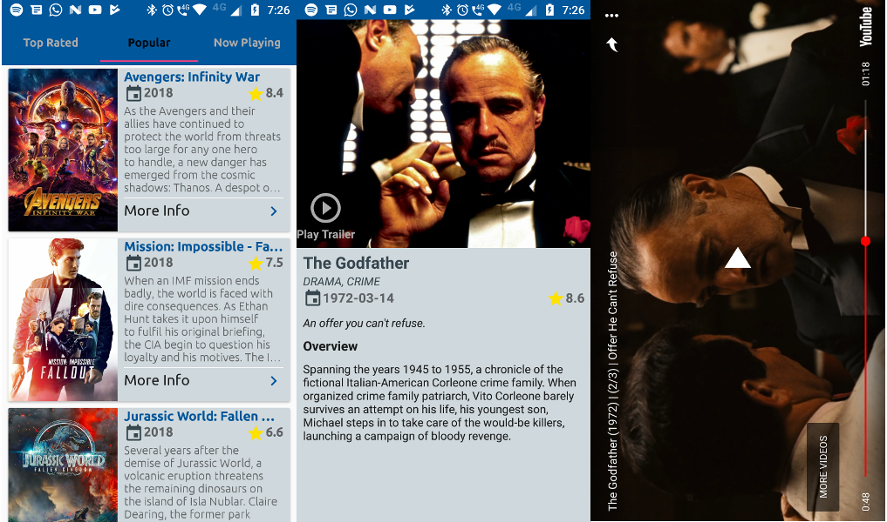

Cinema Sample App
-----------------

This sample is intended to show the main building blocks of an Android app organized under `MVP pattern`, `dependency injection with Dagger` and the `Reactive manifesto`.

Model View Presenter
--------------------

MVP stands for `Model`, `View`, `Presenter`. The main benefit of MVP pattern is the decoupling of data source (Model), UI (View), and business logic (Presenter).
The decoupling in turn makes it easily testable (each piece can be tested separately), reusable (multiple UI screens can share the data and logic), and makes Android's complicated UI components lifecycle handling simple (UI components can be recreated while their data remains intact).

#### Model
`Model` is the data source for the application. In general there should be one shared data Model per application and as such, it's life cycle should be the same as application's. The details on how a Model should work really depend on the application, but for an example, it's a good place to implement REST client, handle authentication, and cache data locally. There should be *no Android related UI code* in Model.

#### View
`View`s are the UI elements that display the data. There should be *no business logic* in Views, they should simply display the data Presenters tell them to display and let the Presenters know of any user interactions ("a button has been clicked" for instance).

#### Presenter
`Presenters` acts as the glue between `Model` and `View`. They should load data from the Model and give the loaded data to Views. Presenters should contain *no Android UI elements* to make their lifecycle not depend on UI elements, and also to make them easier to test.

Dependency injection
--------------------

Dependency injection has been delivered to Dagger 2 on this project.
Dagger 2 is a compile-time evolution approach to dependency injection. Taking the approach started in Dagger 1.x to its ultimate conclusion, Dagger 2.x eliminates all reflection, and improves code clarity by removing the traditional ObjectGraph/Injector in favor of user-specified `@Component` interfaces.
It facilitates the implementation of MVP pattern as shown on the code snippet below. 

```java
    // Within the APP
    public class CinemaApp extends DaggerApplication {
        @Override
        protected AndroidInjector<? extends CinemaApp> applicationInjector() {
            return DaggerCinemaAppComponent.builder()
                    .cinemaApiUrl(BuildConfig.TMDB_BASE_URL)
                    .application(this)
                    .build();
    }
    
    // Within activities and fragments
    public abstract class CinemaBaseActivity<P extends MvpPresenter> extends DaggerAppCompatActivity {
    
        @Inject
        @Nullable
        protected P mPresenter;
        ...
    }
...
```

References
----------

* Android Architecture Blueprints - https://github.com/googlesamples/android-architecture
* Dagger users guide - https://google.github.io/dagger//users-guide.html
* RxJava wiki - https://github.com/ReactiveX/RxJava/wiki

System requirements
-------------------

* Android Studio 3.0+

Libraries
---------

* Retrofit2 - http://square.github.io/retrofit
* RxJava2 - https://github.com/ReactiveX/RxJava
* RxAndroid - https://github.com/ReactiveX/RxAndroid
* Dagger2 - https://google.github.io/dagger
* ButterKnife - http://jakewharton.github.io/butterknife
* Timber - http://github.com/JakeWharton/timber
* YouTube Player API - https://developers.google.com/youtube/android/player
* Glide - https://github.com/bumptech/glide

Useful gradle tasks
-------------------

#### Unit tests

    ./gradlew testLocalDebugUnitTest

#### Integration tests

    ./gradlew connectedLocalDebugAndroidTest

For more information please refer to [building-cmdline](https://developer.android.com/studio/build/building-cmdline.html).


Screenshots
-----------



TODO list
---------

* More coverage on unit tests.
* Coverage on integration tests.
* Online/offline movie search feature.
* Offline support using AAC (Room + LiveData).

License
-------

    Copyright 2018 Emilio Corengia<emiliocorengia@gmail.com>

    Licensed under the Apache License, Version 2.0 (the "License");
    you may not use this file except in compliance with the License.
    You may obtain a copy of the License at

       http://www.apache.org/licenses/LICENSE-2.0

    Unless required by applicable law or agreed to in writing, software
    distributed under the License is distributed on an "AS IS" BASIS,
    WITHOUT WARRANTIES OR CONDITIONS OF ANY KIND, either express or implied.
    See the License for the specific language governing permissions and
    limitations under the License.
